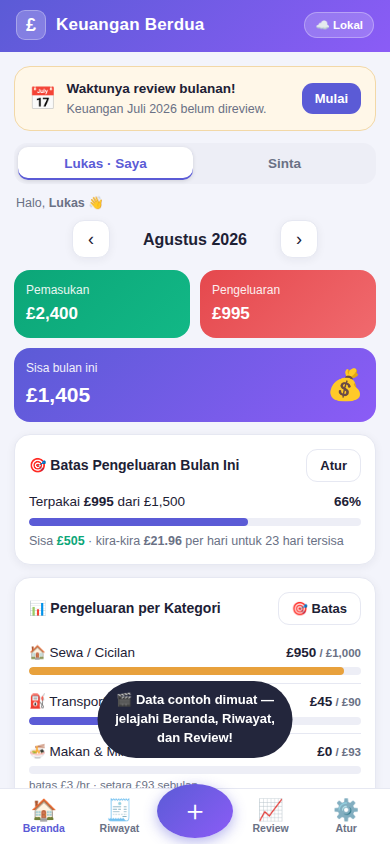
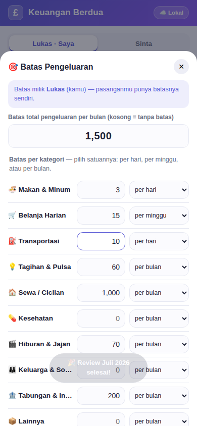
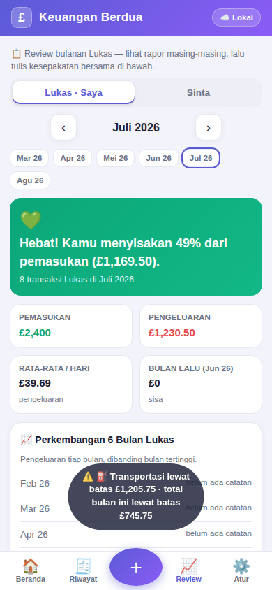

# £ Keuangan Berdua — Catatan Keuangan Bulanan untuk 2 Orang, 2 HP

Aplikasi HP (PWA) untuk mencatat keuangan bulanan **berdua**, dalam **poundsterling (£)**.
Setiap layar menampilkan **keuangan satu orang saja** supaya angkanya tidak tercampur, sementara
datanya **tersinkron real-time** antar HP — ketuk nama pasangan di pengalih atas untuk melihat
perkembangannya. Lengkap dengan anggaran per orang dan **review keuangan setiap bulan**.

## 📲 Buka & Pasang di HP

**https://lukas2407.github.io/Aplikasi-Keuangan/**

1. Buka alamat di atas di browser HP (lakukan di **kedua HP**).
2. **Android (Chrome):** menu ⋮ → *Tambahkan ke layar utama* / *Instal aplikasi*.
3. **iPhone (Safari):** tombol Bagikan ⬆️ → *Tambah ke Layar Utama*.
4. Aplikasi muncul dengan ikon **£**, terbuka layar penuh, dan tetap jalan offline.

📖 Panduan lengkap (termasuk cara menghubungkan 2 HP): **[PANDUAN_KEUANGAN.md](PANDUAN_KEUANGAN.md)**

## ✨ Fitur

- **➕ Catat cepat** — pengeluaran/pemasukan, nominal £ (mendukung pence), kategori, tanggal, catatan. Transaksi masuk ke catatan orang yang sedang ditampilkan.
- **👤 Tampilan per orang** — Beranda, Riwayat, dan Review hanya menampilkan satu orang; aplikasi terbuka pada pemilik HP itu, dan pengalih di atas untuk melihat pasangan.
- **☁️ Dua HP tetap satu data** — sinkronisasi real-time lewat Firebase gratis milik sendiri.
- **🎯 Batas pengeluaran rinci** — batas total bulanan plus batas tiap kategori yang bisa dipatok **per hari, per minggu, atau per bulan**, semuanya dalam satu layar. Beranda menghitung sisa jatah per hari, dan kamu diperingatkan otomatis begitu sebuah batas terlampaui. Batas milik masing-masing orang.
- **📈 Review setiap bulan** — pengingat otomatis di awal bulan, vonis kesehatan keuangan, perbandingan vs bulan lalu, anggaran vs realisasi, 5 pengeluaran terbesar, dan catatan kesepakatan bersama yang ikut tersinkron.
- **📊 Perkembangan 6 bulan** — tren pengeluaran orang yang sedang dilihat, untuk memantau progress masing-masing.
- **💾 Aman** — data tersimpan di HP (offline tetap jalan), ekspor/impor JSON untuk cadangan.

| Beranda | Batas Pengeluaran | Review |
|---|---|---|
|  |  |  |

## 🛠️ Teknis

HTML + CSS + JavaScript murni dalam satu file (`index.html`), PWA (manifest + service worker),
penyimpanan localStorage, sinkronisasi opsional via Firebase Firestore pada akun pengguna sendiri.
Deploy otomatis ke GitHub Pages lewat `.github/workflows/pages.yml`.
