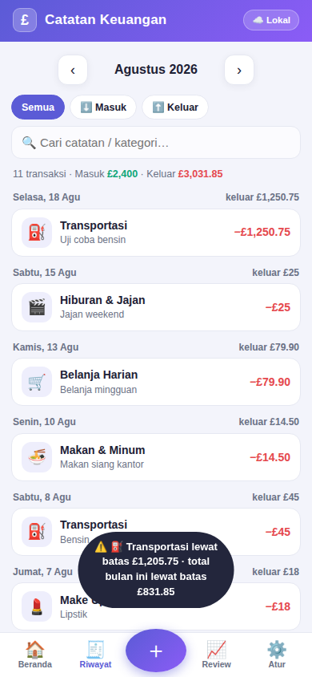
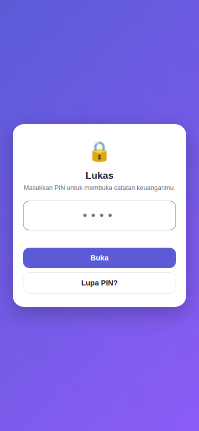
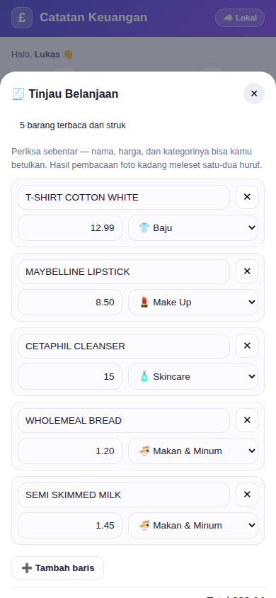
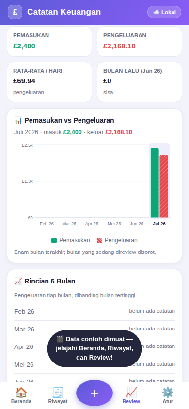
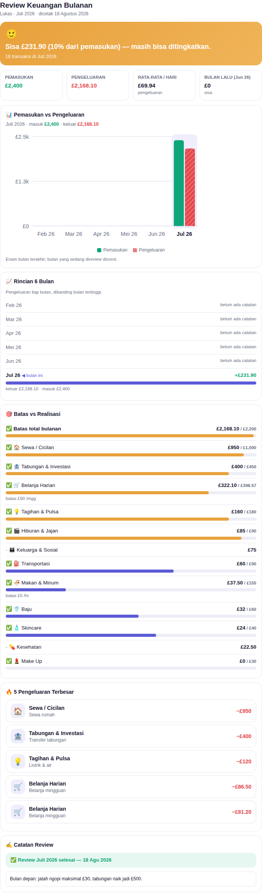

# £ Catatan Keuangan — Pencatatan Bulanan Pribadi

Aplikasi HP (PWA) untuk mencatat keuangan bulanan **pribadi**, dalam **poundsterling (£)**:
pemasukan, pengeluaran, batas pengeluaran yang rinci, scan struk belanja, dan review setiap bulan
lengkap dengan grafik yang bisa disimpan sebagai PDF. Jalan offline, data tersimpan di HP sendiri.

## 📲 Buka & Pasang di HP

**https://lukas2407.github.io/Aplikasi-Keuangan/**

1. Buka alamat di atas di browser HP.
2. **Android (Chrome):** menu ⋮ → *Tambahkan ke layar utama* / *Instal aplikasi*.
3. **iPhone (Safari):** tombol Bagikan ⬆️ → *Tambah ke Layar Utama*.
4. Aplikasi muncul dengan ikon **£**, terbuka layar penuh, dan tetap jalan tanpa internet.

📖 Panduan lengkap: **[PANDUAN_KEUANGAN.md](PANDUAN_KEUANGAN.md)**

## ✨ Fitur

- **📷 Scan struk belanja** — foto struknya, aplikasi membaca dan **merinci apa saja yang dibeli** beserta harganya, menebak kategori tiap barang, lalu menyimpannya sebagai satu transaksi berisi rincian atau dipecah otomatis per kategori. Ada juga jalur ketik/tempel teks untuk pemakaian offline.
- **➕ Catat cepat** — pengeluaran/pemasukan, nominal £ (mendukung pence), kategori, tanggal, catatan.
- **🏷️ Kategori lengkap** — termasuk **Baju 👕, Make Up 💄, dan Skincare 🧴**, dan bisa ditambah sendiri.
- **🎯 Batas pengeluaran rinci** — batas total bulanan plus batas tiap kategori yang bisa dipatok **per hari, per minggu, atau per bulan**, semuanya dalam satu layar. Beranda menghitung sisa jatah per hari, dan kamu diperingatkan otomatis begitu sebuah batas terlampaui.
- **📈 Review setiap bulan** — pengingat otomatis di awal bulan, vonis kesehatan keuangan, perbandingan vs bulan lalu, batas vs realisasi, 5 pengeluaran terbesar, dan catatan review.
- **📊 Grafik & PDF** — grafik batang pemasukan vs pengeluaran 6 bulan di halaman Review, plus tombol **Buat PDF Review** untuk menyimpan laporan rapi lewat *Simpan sebagai PDF* di HP.
- **🔒 Kunci aplikasi** — PIN (di-hash SHA-256) dengan kunci otomatis setelah 5 menit menganggur.
- **☁️ Sinkronisasi antar perangkat (opsional)** — punya HP kedua, tablet, atau ganti HP? Catatannya bisa disamakan lewat Firebase gratis milik sendiri.
- **💾 Aman** — data tersimpan di HP, ekspor/impor JSON untuk cadangan.

| Beranda | Riwayat | Kunci Aplikasi |
|---|---|---|
|  |  |  |

| Scan Struk | Batas Pengeluaran | Grafik Review |
|---|---|---|
|  |  |  |

Hasil review yang disimpan sebagai PDF:

## 🛠️ Teknis

HTML + CSS + JavaScript murni dalam satu file (`index.html`), PWA (manifest + service worker),
penyimpanan localStorage, OCR struk lewat Tesseract.js, grafik SVG tanpa pustaka luar,
sinkronisasi opsional via Firebase Firestore pada akun pengguna sendiri.
